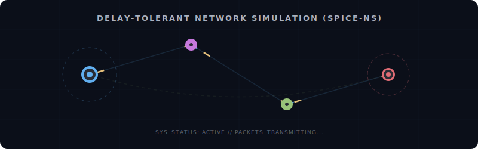

  

<h1 align="center">Jason Pandian</h1>

<b>Systems Developer · Game Dev · Researcher · Programming & DSA Communicator</b>

  

  
  
  

---

### 🌌 Research & Academics

<table align="center" width="100%">
  <tr>
    <td align="center" width="28%">
      
    </td>
    <td width="72%" style="vertical-align: top; padding-left: 20px;">
      <ul>
        <li>🎓 <b>Confirmed Ph.D. Research Scholar</b>: Anna University (Part-Time) — officially approved by the Doctoral Committee to proceed with research under the <b>Faculty of Computer Science and Information Engineering</b>.</li>
         
        <li>🛰️ <b>Thesis Focus</b>: <i>Mitigating Challenges in Deep Space Networking</i> — optimizing routing protocols, congestion dynamics, and delay-tolerant architectures.</li>
         
        <li>🏫 <b>Academic Instruction & Mentorship</b>: Assistant Professor and <b>Programming & DSA Communicator</b>. Active instructor in core programming paradigms, data structures & algorithms (DSA), and agentic/autonomous AI coding technologies.</li>
      </ul>
    </td>
  </tr>
</table>

---

### 🎤 Conference Talks & Presentations
*   🇯🇵 **[ICNS3 2025](https://www.nsnam.org/research/icns3/icns3-2025/program/) (Ritsumeikan, Japan)**: Presented a Lightning Talk remotely at *The International Conference on ns-3 (ICNS3)* on **"A Simple Geospatial Propagation Model for Deep Space Communication Simulations in ns-3"**.
*   🇪🇸 **[WNS-3 2024](https://www.nsnam.org/research/wns3/wns3-2024/program/) (Barcelona, Spain)**: Presented a Lightning Talk remotely at the *Workshop on ns-3 (WNS-3)* on **"Modeling the Astrodynamics of Space Missions in ns-3 for High-Fidelity Simulations of Deep Space Communications"**.

---

### 🛠️ Tech Stack & Tooling

  
  
  
  
  
  
  

---

### 🚀 Code Portfolio

#### 📡 Space Systems & Network Simulations
*   **[SPICE-ns-Project](https://github.com/PandiaJason/SPICE-ns-Project)** — A next-gen simulation framework extending **ns-3** to model DSN (Deep Space Network) and DTN (Delay-Tolerant Networking) communications.
*   **[qubo-space-routing](https://github.com/PandiaJason/qubo-space-routing)** — A Path-Constrained Lagrangian **QUBO (Quadratic Unconstrained Binary Optimization)** mathematical routing architecture for survivable routing in space networks.
*   **[ns3](https://github.com/PandiaJason/ns3)** — Custom planetary communication simulation nodes and models based on ns-3.
*   **[DSN](https://github.com/PandiaJason/DSN)** — A learning log and reference repository dedicated to deep space networking mechanics.

#### 🦀 High-Performance & AI Infrastructure
*   **[nanos](https://github.com/PandiaJason/nanos)** — Rust-based, hardware-isolated WebAssembly micro-runtime for AI agents with Apple Metal/CUDA GPU offload. Tailored for extreme efficiency (<15MB RAM, <50ms boot).
*   **[MidDB](https://github.com/PandiaJason/MidDB)** — Lightweight C++ hybrid database prototype combining structured tables with semantic vector embedding memory for AI agent memory.
*   **[bats](https://github.com/PandiaJason/bats)** — *WAND (Watch. Audit. Never Delegate)*: A Go-native deterministic safety enforcement and policy auditing layer for autonomous AI agents and MCP tools.
*   **[antapi](https://github.com/PandiaJason/antapi)** — Go-native REST API with Redis caching, Prometheus metrics, and API-key auth for orchestrating multiple LLM agents and agentic *Teams* (local & cloud models).
*   **[ninai](https://github.com/PandiaJason/ninai)** — A local-first desktop app unifying AI tools and note-taking into one seamless, unified workspace (TypeScript).
*   **[AI-Chatbot-using-Deep-Learning-based-NLP](https://github.com/PandiaJason/AI-Chatbot-using-Deep-Learning-based-NLP)** — Deep learning-based conversational NLP chatbot architecture.

#### 🔗 Web3, Cryptography & Security
*   **[Proof-of-Knowledge-On-Chain](https://github.com/PandiaJason/Proof-of-Knowledge-On-Chain)** — EVM decentralized credential verification system using Non-Transferable Soulbound NFTs and extensible ZoKrates-based Proofs in Solidity.
*   **[dvault-docs](https://github.com/PandiaJason/dvault-docs)** — Multi-sig contract wallet design using ERC-4337 Account Abstraction.
*   **[contrackts-docs](https://github.com/PandiaJason/contrackts-docs)** — Multi-party end-to-end blockchain traceability registry.
*   **[jsncrypts-docs](https://github.com/PandiaJason/jsncrypts-docs)** — Smart contract-based decentralized newsletter subscription system.

#### 🎮 Graphics, Games & Computer Vision
*   **[amphitude](https://github.com/PandiaJason/amphitude)** — A serverless P2P multiplayer platform fighter game built from scratch in C++ & SDL2, utilizing a custom reliable UDP protocol with NAT Hole Punching (STUN) for zero-latency peer connection.
*   **[ranotot](https://github.com/PandiaJason/ranotot)** — *Ranotot* — A gravity-based 2D space cargo delivery platformer with orbital mechanics, developed in Godot 4.6.
*   **[classic](https://github.com/PandiaJason/classic)** — The predecessor release of the *Ranotot* 2D space delivery game featuring planet gravity mechanics.
*   **[gyrox](https://github.com/PandiaJason/gyrox)** — Flask & MediaPipe portrait image processor. Performs automatic background segmentation and selective depth-of-field Gaussian blur.
*   **[avae](https://github.com/PandiaJason/avae)** — Highly styled, animated interactive "Link in Bio" creator landing page.

#### 🎓 Academics, Labs & DSA Playgrounds
*   **[cnl-codetainers](https://github.com/PandiaJason/cnl-codetainers)** — Lightweight, Docker-isolated sandbox environment for running computer networks laboratory experiments and academic curricula.
*   **Curricula & Notes**: Jupyter Notebook tutorials for **[Python](https://github.com/PandiaJason/Python)**, **[ANSI-C](https://github.com/PandiaJason/ANSI-C)**, **[OOP-LAB](https://github.com/PandiaJason/OOP-LAB)**, **[java](https://github.com/PandiaJason/java)**, and **[PSPP-LAB](https://github.com/PandiaJason/PSPP-LAB)**.
*   **DSA Practice**: Native implementations of data structures & algorithms in **[C_DSA](https://github.com/PandiaJason/C_DSA)**, **[DSA-C](https://github.com/PandiaJason/DSA-C)**, and **[blind75](https://github.com/PandiaJason/blind75)**.

---

### 🏆 Recognitions & Honors
*   🥇 **Best Researcher Award (2025)** – *ICNGTS International Conference on Sustainable New-Gen Technologies*
*   🥇 **Best Faculty of the Year (2024)** – *Nehru Institute of Technology*
*   🏆 **Best Mini Project Award of the Year** – *Dept. of CSE, IIC, MHRD (2019-2020)*
*   🥇 **Gold Medal for Best Student of the Year** – *TCE Hostel (2018-2019)*
*   🎓 **Certificate of Excellence** – *Dept. of CSE (2018-2019)*

---

### 📊 GitHub Activity Metrics

<table align="center" width="100%">
  <tr>
    <td align="center" width="50%">
      
    </td>
    <td align="center" width="50%">
      
    </td>
  </tr>
</table>

---

  Generated with 💙 by Jason Pandian. If you find my projects helpful, feel free to drop a ⭐ on them!

